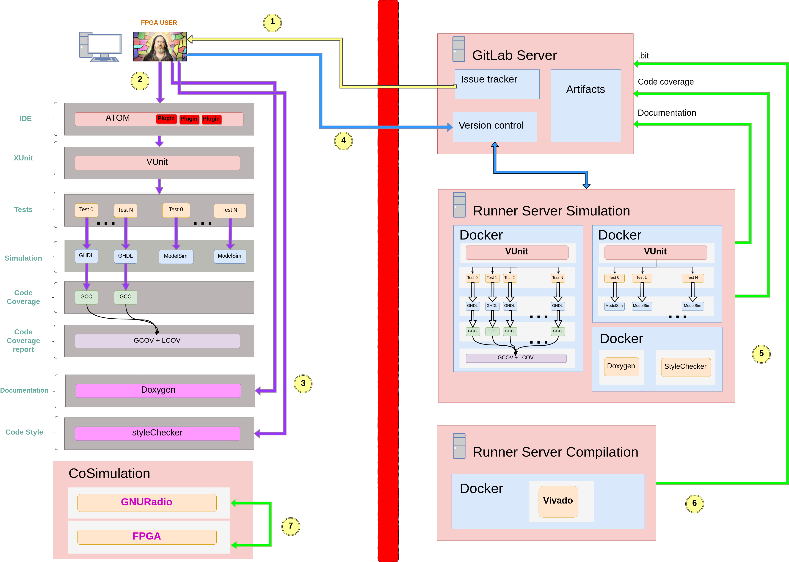
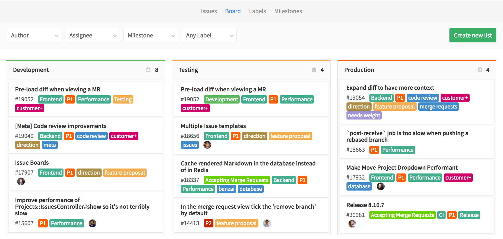

# fpga-knife

**An effective, scalable and reliable FPGA workflow.** It has been successfully implemented in complex defense projects at DAS Photonics.

## Diagram

### Left: FPGA user

#### IDE: ATOM

**A hackable text editor for the 21st Century**

Atom is a free and open-source text and source code editor for macOS, Linux, and Microsoft Windows with support for plug-ins written in Node.js, and embedded Git Control, developed by GitHub. Atom is a desktop application built using web technologies. Most of the extending packages have free software licenses and are community-built and maintained.

- Packages:

  -  **sync-settings**: Synchronize package settings, keymap and installed packages.
  https://atom.io/packages/sync-settings
  
  -  **highlight-selected**: Highlights the current word selected when double clicking.
  https://atom.io/packages/highlight-selected
  
  -  **git-time-machine**: Visually interact with git commit history for a file.
  https://atom.io/packages/git-time-machine
  
  -  **sublime-style-column-selection**: Enable Sublime style 'Column Selection'. Just hold 'alt' while you select, or select using your middle mouse button.
  https://atom.io/packages/sublime-style-column-selection
  
  -  **language-vhdl**: VHDL language support in Atom.
  https://atom.io/packages/language-vhdl
  
  -  **linter-vhdl**: VHDL linter.
  https://atom.io/packages/linter-vhdl
  
  -  **hdl-tb-converter**: Convert a VHDL entity into a component, instance or signal definitions, using the clipboard.
  https://atom.io/packages/hdl-tb-converter

- snippets: Snippets are a powerful way to quickly generate commonly needed code syntax from a shortcut.

#### Xunit: VUnit

VUnit is an open source unit testing framework for VHDL/SystemVerilog released under the terms of Mozilla Public License, v. 2.0. It features the functionality needed to realize continuous and automated testing of your HDL code. VUnit doesn’t replace but rather complements traditional testing methodologies by supporting a “test early and often” approach through automation.

#### Simulation: GHDL

GHDL is an open-source simulator for the VHDL language.

GHDL fully supports the 1987, 1993, 2002 versions of the IEEE 1076 VHDL standard, and partially the latest 2008 revision (well enough to support fixed_generic_pkg or float_generic_pkg).

By using a code generator (llvm, GCC or a builtin one), GHDL is much faster than any interpreted simulator. GHDL runs on Linux, Windows and Apple OS X.

#### Simulation: ModelSim

ModelSim is a multi-language HDL simulation environment by Mentor Graphics, for simulation of hardware description languages such as VHDL, Verilog and SystemC, and includes a built-in C debugger.

#### Code coverage: gcc

The GNU Compiler Collection (GCC) is a compiler system produced by the GNU Project supporting various programming languages. GCC is a key component of the GNU toolchain and the standard compiler for most Unix-like operating systems.

Third-party front ends exist for VHDL (ghdl).

#### Code coverage report: Gcov - Lcov

Gcov is a source code coverage analysis and statement-by-statement profiling tool. Gcov generates exact counts of the number of times each statement in a program is executed and annotates source code to add instrumentation. Gcov comes as a standard utility with the GNU Compiler Collection (GCC) suite.

#### Documentation: Doxygen

Doxygen is the de facto standard tool for generating documentation from annotated C++ sources, but it also supports other popular programming languages such as C, Objective-C, C#, PHP, Java, Python, IDL (Corba, Microsoft, and UNO/OpenOffice flavors), Fortran, VHDL, Tcl, and to some extent D.

#### Code style

#### Cosimulation: GNURadio

GNU Radio is a free & open-source software development toolkit that provides signal processing blocks. It can be used without hardware in a simulation-like environment. It is widely used in research, industry, academia, government, and hobbyist environments.

Extending GNU Radio is also quite easy; if you find a specific block that is missing, you can quickly create and add it.

### Rigth: automated tasks

#### GitaLab server: issue tracker

The GitLab Issue Tracker is an advanced and complete tool for tracking the evolution of a new idea or the process of solving a problem.

It allows you, your team, and your collaborators to share and discuss proposals before and while implementing them.

https://docs.gitlab.com/ee/user/project/issues/

#### GitLab server: version control

Git server

#### GitLab server: continuous integration

Every commit that is pushed to GitLab generates a pipeline attached to that commit. If multiple commits are pushed together the pipeline will be created for the last one only. A pipeline is a collection of jobs split in different stages.

https://about.gitlab.com/2018/01/22/a-beginners-guide-to-continuous-integration/

All the jobs in the same stage run concurrently (if there are enough runners) and the next stage begins only if all the jobs from the previous stage have finished with success.

As soon as a job fails, the entire pipeline fails. There is an exception for this, as we will see below: if a job is marked as manual, then a failure will not make the pipeline fail.

#### GitLab server: artifacts

As we said, a job can create an artifact that users can download to test. It can be anything, like an application for Windows, an image generated by a PC, or an APK for Android.

https://about.gitlab.com/2018/01/22/a-beginners-guide-to-continuous-integration/

#### Docker

Docker is a computer program that performs operating-system-level virtualization, also known as "containerization".

